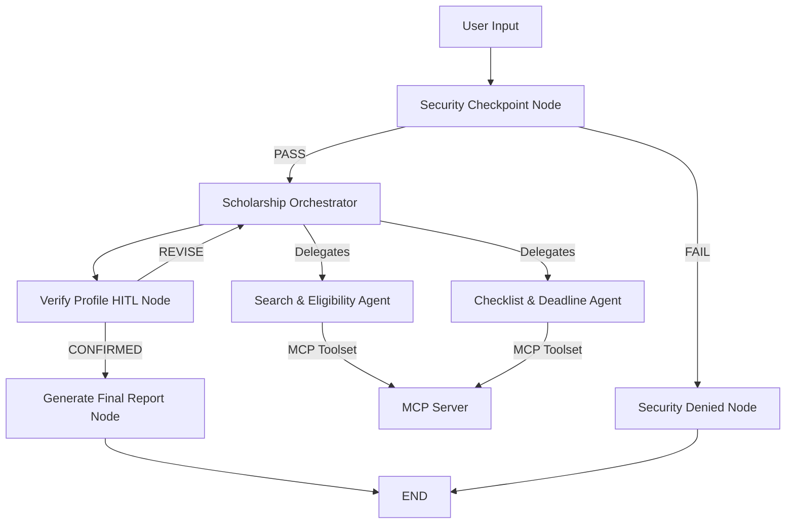

# Submission Write-Up: Scholarship Navigator

## Problem Statement

Finding and applying for scholarships is a fragmented, complex, and time-consuming process. Students frequently miss life-changing financial aid opportunities because relevant information is scattered across thousands of websites, eligibility rules are difficult to parse, and application checklists or deadline schedules are easily overlooked. 

Scholarship Navigator provides a centralized, secure, and personalized AI advisor that automates the matching of student profile details to eligible scholarships, generates custom document checklists, and tracks critical application dates, easing the burden of financing higher education.

## Solution Architecture

The system utilizes a hybrid orchestration graph where a secure checkpoint filters input, an orchestrator directs communication with specialized agents, and a Human-in-the-Loop node verifies parameters before generating final outcomes.

## Concepts Used

1. **ADK Workflow**: Structured execution graph containing function nodes (`security_checkpoint`, `verify_profile`, `generate_final_report`) and agent nodes to coordinate the matching logic. Defined in [agent.py](file:///d:/workspace-1/scholarship-navigator/app/agent.py#L225).
2. **LlmAgent**: Specialist agents (`search_eligibility_agent` and `checklist_reminder_agent`) built with Gemini 2.5 models to handle reasoning tasks. Defined in [agent.py](file:///d:/workspace-1/scholarship-navigator/app/agent.py#L54-L70).
3. **AgentTool**: Hierarchical delegation wrapping sub-agents as tools so the main orchestrator can consult them on-demand. Defined in [agent.py](file:///d:/workspace-1/scholarship-navigator/app/agent.py#L71-L82).
4. **MCP Server**: FastMCP server (`mcp_server.py`) exposing custom tools for querying the scholarship database. Defined in [mcp_server.py](file:///d:/workspace-1/scholarship-navigator/app/mcp_server.py).
5. **Security Checkpoint**: Middleware function node scanning user inputs for attacks and sanitizing parameters. Defined in [agent.py](file:///d:/workspace-1/scholarship-navigator/app/agent.py#L110).
6. **Agents CLI**: Project structures, environment files, and manifests constructed using the `agents-cli` tool.

## Security Design

- **PII Scrubbing**: Regex filters automatically scrub phone numbers and email addresses to protect student privacy before queries reach the LLM.
- **Prompt Injection Defense**: An intercept keyword list blocks instructions override attacks, routing malicious inputs to a safe error node.
- **JSON Audit Logging**: Log records tracking security events (`INFO`, `WARNING`, `CRITICAL`) are structured as JSON for enterprise-grade observability.
- **Domain Constraint Validation**: Financial income is validated to reject negative amounts, preventing illogical queries from being sent to sub-agents.

## MCP Server Design

Exposes domain-relevant tools that act as the interface to the mock scholarship database:
- `search_scholarships`: Filters available funding by search keywords, degree level, and major.
- `get_scholarship_details`: Retrieves the detailed requirements and criteria.
- `get_application_deadlines`: Outputs dates and tracking status of matches.

## Human-in-the-Loop (HITL) Flow

A `verify_profile` node is placed between the Orchestrator and final report compilation. Since scholarship data requirements are strict, the workflow yields `RequestInput` to pause and display a profile summary to the student. Execution resumes only when the user confirms their profile, ensuring matching and checklist generation are accurate.

## Demo Walkthrough

1. **Case 1: Standard Search**: A student with a GPA of 3.8 and family income of $45,000 matches two scholarships. The HITL verification pauses the run, confirms the inputs, and outputs the detailed final checklist and dates.
2. **Case 2: Security Breach**: A prompt injection input (`ignore previous instructions...`) is flagged by the security checkpoint, logging a `CRITICAL` alert and outputting a denial notification.
3. **Case 3: Data Error**: A student enters a negative income value. The security checkpoint rejects the input, logs a `WARNING`, and aborts workflow execution.

## Impact & Value Statement

Scholarship Navigator democratizes access to financial aid by saving students hours of research, translating complex eligibility rules, and providing action-oriented application checklists. It reduces the rate of missing deadlines and helps low-income and high-achieving candidates connect with educational resources they deserve.
